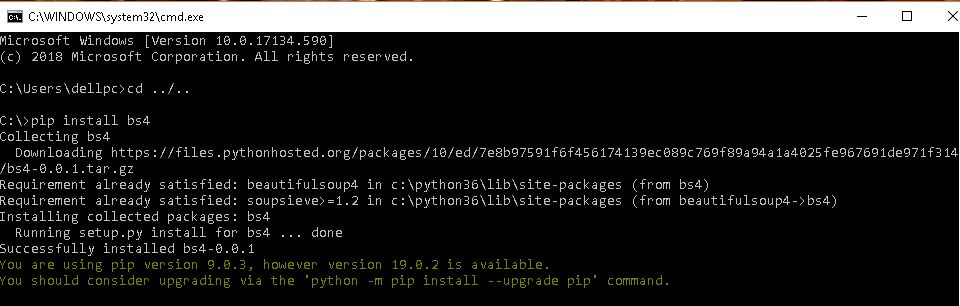
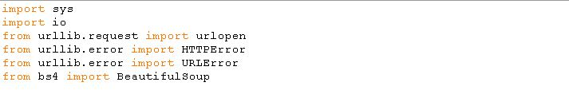
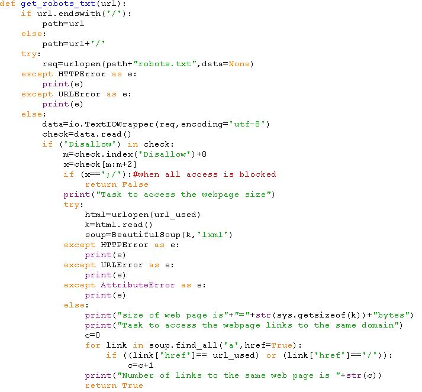

# opengenus_internship_task
It has been a very good experience to complete the assignment that I have been given by OpenGenus Foundation for the internship screening task.
The task that I am assigned states :- 
To develop a script in any language which will take a URL as an input and output the following information: 
<b>1)Size of the webpage in bytes </b>
<b>2)Number of links in that page pointing to same domain (find \<a\> tags) </b>

The concept behind this process is to gain the information about a webpage with the help of a URL and this can be achieved in several ways , two most common ones are 
<b>1)Using API </b>
<b>2)Using Web Scraping </b>
Well the first method is not always suitable as we many times the API are not present or for that purpose we have to rely on third parties ;besides there are certain strict rules on the data that is sent or returned in JSON  .
Hence the preferred way is Web Scraping as it's very customizable, and not having such rules. 
<b>a)</b>Now it's very important to ensure that we should not scrape a site thats does not allow access , although for the tasks assigned such problem won't
appear.For that we use robots.txt file . 
<b>b)</b>We also need to make sure that while requesting for a web page , we don't get errors and if we get then display error messages efficiently(HTTPError,URLError,etc..) 
<b>c)</b>In order to find the size of webpage in bytes ,we use sys module in python and then by .getsizeof() we find the size of the webpage in text format. 
<b>d)</b>In order to find the links on the webpage to the same domain we have used BeautifulSoup ,a python library ,to find all \<a\> tags that have links to the same domain ,ie, href="/" or href="same webpage url " and count the result in c
(we could also have used str.count approach)   
Following are the screenshots:- 
1)install bs4 (BeautifulSoup) 
 
2)importing required packages 
 
3)taking url as input and calling function to check
.JPG) 
4)main content 
 
Following is the video to show the working: 
https://drive.google.com/open?id=11CmS-L-e36Pt4d_MyRO3d6hMIdS5lEju 
https://drive.google.com/open?id=1fHRgTlNVeo-JrfmiGwHDgJ9y9YWxVy1g

